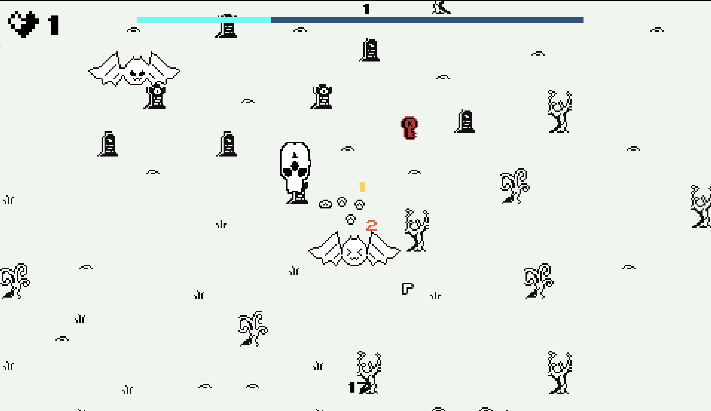
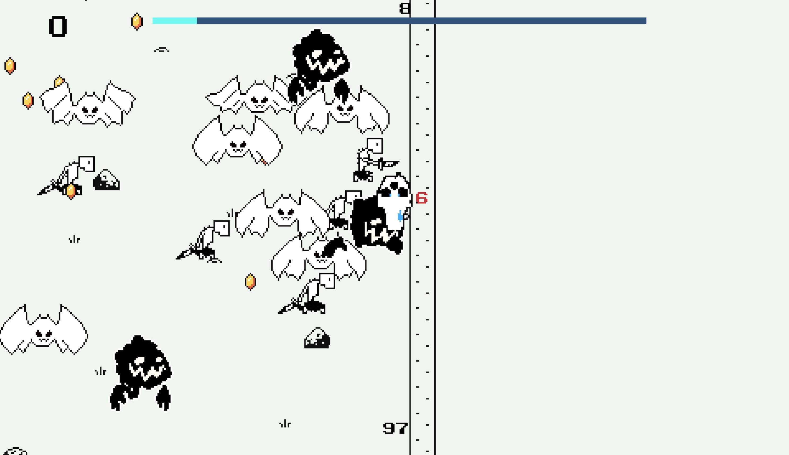
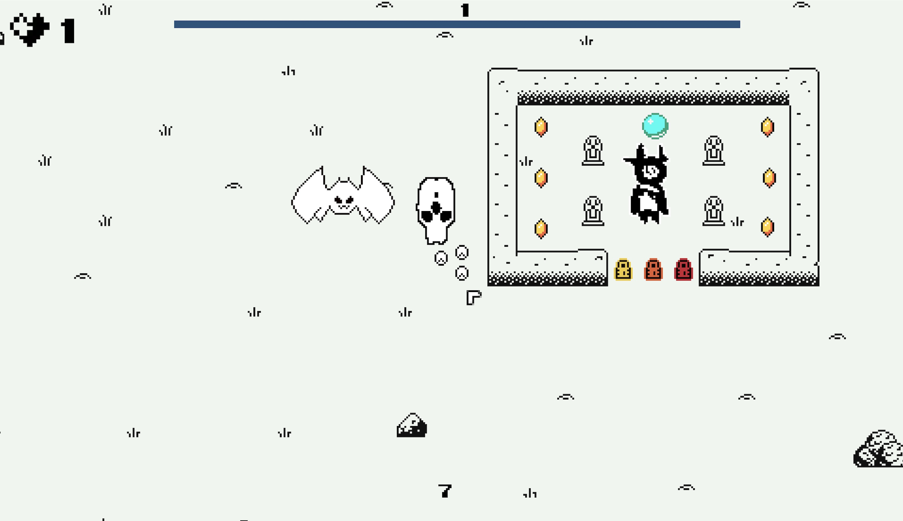
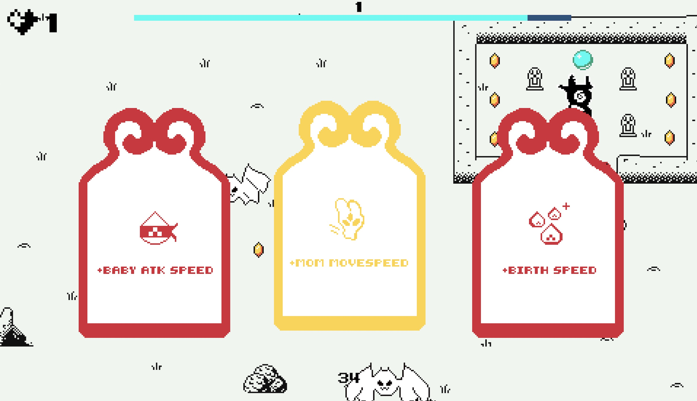

# MotherBaby

**MotherBaby** is a 2D survival-action game with pixel-art aesthetics. Inspired by games like *Vampire Survivors*, you control both a mother and her children as you fight through waves of enemies. Your goal is simple: survive, protect, and guide.

## Screenshots

  

## Gameplay

Switch between the mother and her children at any time. The mother moves cautiously through the world, while the children act as her shield and sword.

- Navigate a hostile world full of threats
- Fight off enemies using the children as defenders
- Keep the mother safe and reach the end
- Tense survival action with an escort dynamic

## Controls

| Action                  | Keys / Mouse             |
| ----------------------- | ------------------------ |
| Move Mother             | W A S D                  |
| Move Children           | Arrow keys or Mouse      |
| Toggle Mouse Control    | Q                        |
| Switch Camera Mode      | Space or Shift           |

## How to Run
You can play it here: [https://barssbekk.itch.io/mother-baby](https://barssbekk.itch.io/mother-baby)

**Note:**  
This game was originally created for the *GoedWare Game Jam – Limited Color Palette Edition*, based on the theme **"Two points of view"**.
